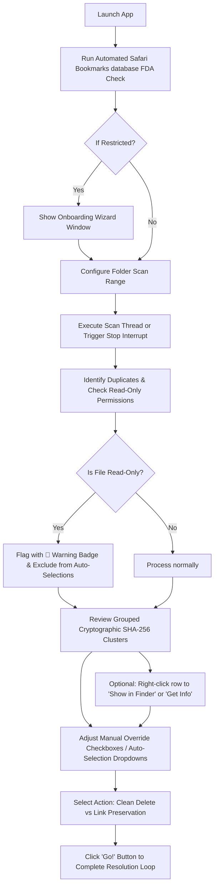

# auDO File Z
> **Nostalgic Cryptographic File Deduplication for macOS**  
> *Platform-Aware Approved Self-Update System*

---

## 1. Overview & Context

**auDO File Z** (Version 9000.4) is a high-performance, native macOS full-stack desktop application designed to securely scan directories, identify identical files cryptographically, and resolve duplicates visually. 

The application is styled with a rigid, nostalgic **DoorsXP-Z** (formerly retro Luna Theme) or **VinylBox-Z (Dark DJ Mode)** aesthetic, bringing back early-2000s desktop nostalgia while executing lightning-fast, modern backend file systems operations on Apple Silicon.

### Key Architectural Pillars:
*   **Platform-Aware Self-Updates**: Built-in system checking GitHub Releases API, parsing architecture compatibility (Intel vs Apple Silicon), and downloading assets with explicit user consent.
*   **Size-First Optimized Indexing**: Files are indexed by exact byte size first. Hashing is only performed on size matches, skipping 90% of unique files automatically.
*   **Rayon Parallel Processing**: Utilizes multi-threaded SHA-256 cryptographic hashing to run scans across all CPU cores.
*   **Buffer-Streamed Hashing**: Reads file contents in constant 8KB chunks, preventing memory/RAM spikes on multi-gigabyte files.
*   **macOS Sandbox Compliance**: Moves resolved files to the native macOS Trash (`~/.Trash`) using Finder APIs instead of executing permanent destructive commands.

---

## 2. Installation & Setup

### Terminal Installation (via curl)
You can download, extract, and install the latest release directly into your `/Applications` folder using the following command in your terminal:
```bash
curl -L -s https://github.com/notmnky/auDO-File-Z/releases/latest/download/audofilez.app.tar.gz | tar -xz -C /Applications
```

> [!WARNING]
> **macOS Gatekeeper Warning**: Because this application is compiled locally and is not signed/notarized with a paid Apple Developer Account, macOS will block it from running with a warning.
> To bypass this, run the following command in your Terminal to strip the quarantine flag:
> ```bash
> xattr -cr /Applications/auDO\ File\ Z.app
> ```

### Full Disk Access (FDA) Onboarding
To read protected user directories and calculate file hashes, macOS requires Full Disk Access:
1. Open **System Settings** -> **Privacy & Security** -> **Full Disk Access**.
2. Click the **Add (+)** button at the bottom of the list.
3. Select **auDO File Z** (or your Terminal program if running from source) and enable the toggle switch.

---

## 3. Operation Flowchart

The following flowchart describes the step-by-step application logic path:



---

## 4. Configuration & Scanning

### Running Extension Sweeps
1.  **Select Directory**: Click the **Browse...** button to launch the native directory selector and target your search folder.
2.  **Filter Extensions**: Enter comma-separated formats in the extension textbox (e.g. `.mp3, .wav, .flac`).
    *   **Custom Extension Sweeps**: You can input custom extensions like `.txt, .png, .pdf`. Separate them with commas. The textbox is limited to 300 characters.
    *   **Empty State Default**: By default, the extension field defaults to an empty string. Leaving it completely blank will scan all file types.
3.  **One-Click "Audio files only" Macros**:
    *   Click the **Audio files only** shortcut button to automatically load common audio extensions: `.mp3, .wav, .flac, .aiff, .aac, .m4a, .ogg`.
4.  **Run Scan**: Click the **Scan** button. Rayon threads will crawl, pre-filter, hash duplicate size candidates in parallel, and populate the grid.

---

## 5. Selection & Resolution Modes

### Dynamic Selection Mode
Using the dropdown above the table, choose how checkmarks are set:
*   **Manually Select**: Manually toggle checks.
*   **Auto-Select Oldest**: Automatically checks older duplicate copies, leaving the newest (most recently modified) copy unchecked (preserved as original). Any read-only files are bypassed and kept unchecked.
*   **Auto-Select Newest**: Automatically checks newer duplicate copies, leaving the oldest copy unchecked (preserved as original). Any read-only files are bypassed and kept unchecked.

### Resolution Engine Options
Before resolving duplicates, toggle the action type at the bottom:
1.  **Clean Delete (Move to Trash)**: Relocates checked duplicates to your macOS Trash.
2.  **Link Preservation**: Moves duplicate copies to Trash and instantly replaces them with symbolic links pointing directly back to the preserved original copy.
3.  Click the **Go!** button to execute the resolution loop.

---

## 6. Dynamic Skin Swapping

Customize the application's visual layout dynamically to match your preference:
*   **DoorsXP-Z (Retro)**: The default nostalgic Windows XP Luna theme featuring a bright blue title bar, retro grey bevels, and classic `#ECE9D8` dialog boxes.
*   **VinylBox-Z (Dark)**: A dark, sleek, professional theme mimicking the Rekordbox / AlphaTheta DJ aesthetic, featuring matte black backgrounds (`#121212`), high-contrast neon orange accents (`#FF6600`), flat edges, and customized dark scrollbars.

You can toggle skins instantly by selecting them from the native macOS application menu under **View > Skins** or the custom in-window dropdown menu.

---

## 7. Safety Mitigation Guardrails

*   **Anti-Data Loss validation**: You can change checkpoints freely, but the application enforces that at least one copy in each duplicate group must remain unchecked. If you attempt to check all copies, a flashing warning displays and disables the action button.
*   **Circular Symlink Block**: The Rust backend validates that the target preserved file is not itself scheduled for deletion in the queue. If a circular reference loop is detected, the command aborts.
*   **Read-Only File Protections**: Files with read-only permissions are marked with a `🛑` warning badge next to their checkbox. They are automatically skipped during any "Auto-Select" routines, and a warning note: `"🛑 Notice: Read-only files found in clusters"` is displayed in the bottom status panel when such files exist in the scan results.

---

## 8. Development & Credits
*   **Author**: Nishank / notMNKY
*   **Email**: [nishank@gmx.de](mailto:nishank@gmx.de)
*   **Support Developer**: [Kofi Support Profile](https://ko-fi.com/nishank)
*   **Frameworks**: Tauri v2, React + TS, Tailwind CSS v3, Rust (std::fs, rayon, sha2, trash, rfd)
*   **Master Repository**: [https://github.com/notmnky/auDO-File-Z](https://github.com/notmnky/auDO-File-Z)
